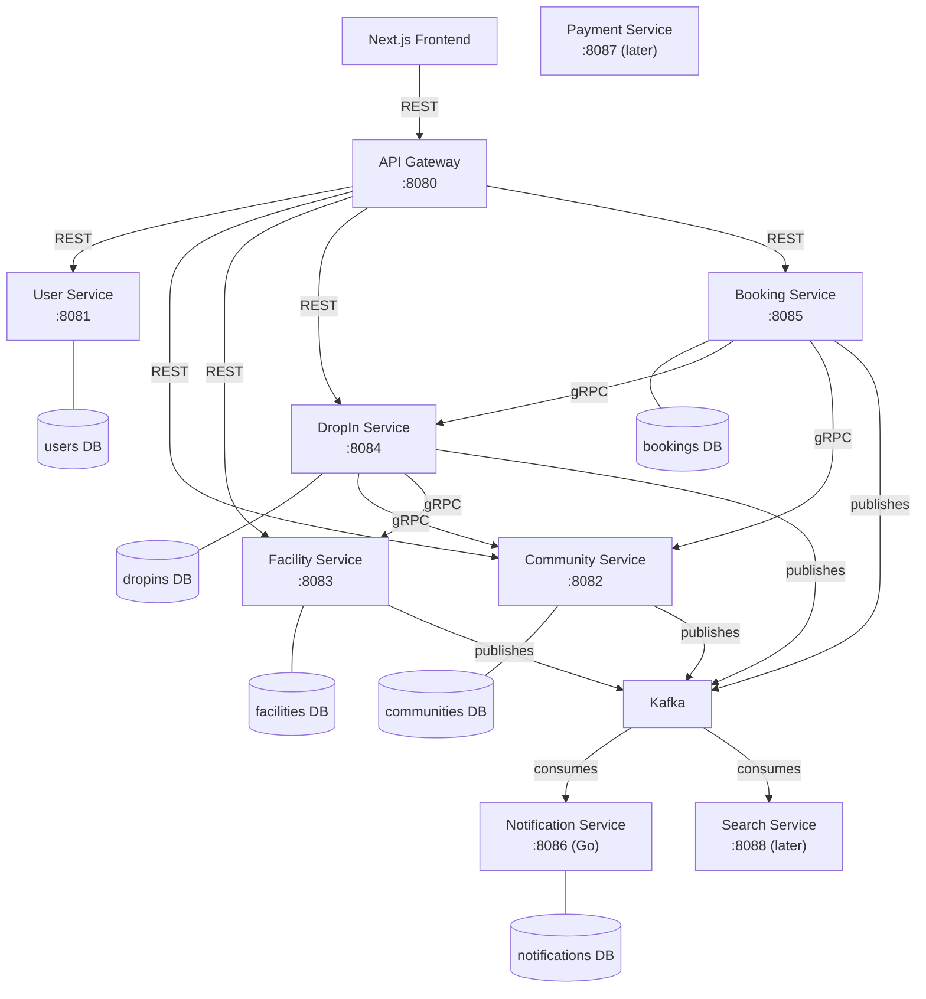

# CourtSync MASTER.md

## 1. Project Name

CourtSync

---

## 2. Project Summary

CourtSync is a full-stack volleyball platform where **players** can discover and join
drop-in sessions, **hosts** can organise drop-ins at their own locations or inside a rented
facility space, **communities** can manage member-only games, and **facilities** can list
their rentable volleyball spaces.

This project is primarily for learning and demonstrating:

* Full-stack development
* Polyglot microservices architecture
* Java Spring Boot (domain services)
* Go microservices (event-driven workers)
* Optional Rust service later (analytics)
* Next.js frontend
* PostgreSQL
* Kafka event-driven communication
* gRPC synchronous inter-service calls
* Redis caching and locking
* Docker and Docker Compose
* Kubernetes later
* Stripe payments later
* Resend email notifications later
* Elasticsearch geo-search later

The first goal is **not** to build the entire finished product.

The first goal is to build a clean microservices skeleton with one working end-to-end flow:

```
Create community
→ Create facility + space
→ Create drop-in (at a facility space or a custom location)
→ Book a spot in the drop-in
→ Publish BOOKING_CREATED to Kafka
→ Notification Service and Search Service consume and log the event
```

---

## 3. Core Architecture



Main services:

```
api-gateway          Java Spring Boot
user-service         Java Spring Boot
community-service    Java Spring Boot
facility-service     Java Spring Boot   (evolved from court-service)
dropin-service       Java Spring Boot
booking-service      Java Spring Boot   (extracted from dropin-service RSVP)
notification-service Go
payment-service      Java Spring Boot   (later)
search-service       Java Spring Boot   (later)
analytics-service    Rust               (optional, later)
```

Infrastructure:

```
PostgreSQL (hosted Supabase, one schema per service)
Kafka (KRaft, no Zookeeper)
Redis
Docker / Docker Compose
Kubernetes later
Elasticsearch later
```

---

## 4. Important Design Rule

Build the project using **vertical slices**. Do not build the whole backend first and then
the whole frontend.

```
Backend slice
→ API Gateway route
→ Frontend page / component
→ Kafka event + consumer log
→ repeat
```

Example vertical slice for booking:

```
bookings table
→ Booking Service endpoint POST /bookings
→ API Gateway route /api/bookings/**
→ Next.js Book button
→ BOOKING_CREATED event
→ Notification Service logs it
```

---

## 5. Tech Stack

### Frontend

```
Next.js + TypeScript
Tailwind CSS
shadcn/ui
TanStack Query
```

### Core Backend Services (Java)

```
Java 21 (toolchain Java 26 ok)
Spring Boot 4.0.x (Spring Framework 7)
Spring Web
Spring Data JPA
Spring Kafka  (spring-boot-starter-kafka)
Spring gRPC   (org.springframework.grpc)
PostgreSQL
Redis
Maven (./mvnw)
```

### Go Service

```
notification-service — consumes Kafka events, logs them, sends emails later
```

### Messaging

```
Kafka (KRaft)  — async events ("something happened, others may react")
gRPC           — synchronous cross-service calls (immediate answer needed)
REST           — browser ↔ API Gateway only
```

### Optional Rust Service (later)

```
analytics-service — consumes Kafka, computes metrics
```

---

## 6. Repository Structure

```
courtsync/
  MASTER.md
  README.md
  docker-compose.yml
  .gitignore
  .env.example

  services/
    api-gateway/
    user-service/
    community-service/          ← new
    facility-service/           ← renamed from court-service
    dropin-service/
    booking-service/            ← new (extracted from dropin-service RSVP)
    notification-service/       (Go)
    payment-service/            (later)
    search-service/             (later)
    messaging-service/          (deferred placeholder)
    frontend/

  shared/
    proto/
      facility.proto            ← evolves from court.proto
      community.proto           ← new
      dropin.proto              ← new
    event-contracts/
      events.md

  infra/
    k8s/
```

Java package root per service: `com.courtsync.<svc>/`

---

## 7. Service Ownership

Each microservice owns its own data. A service must **never** directly query another
service's database. Cross-service references are plain UUID columns — not foreign keys.

```
Correct:   DropIn Service calls Facility Service gRPC to validate a space.
Incorrect: DropIn Service queries the facilities schema directly.
```

For local development and hosted Supabase: one PostgreSQL database, one schema per service.

Service schemas:

```
users
communities
facilities
dropins
bookings
notifications
payments (later)
```

---

## 8. Services

### 8.1 API Gateway

Language: Java Spring Boot (Spring Cloud Gateway 5.0 / Spring Cloud 2025.1.x)

Purpose: The only backend entry point the frontend calls.

Responsibilities:

```
Receive requests from the frontend
Route to the correct backend service
Forward auth tokens (later)
Add correlation IDs to every request
Rate limiting (later)
Hide internal service URLs
```

Routes:

```
/api/users/**        → user-service:8081
/api/communities/**  → community-service:8082
/api/facilities/**   → facility-service:8083
/api/drop-ins/**     → dropin-service:8084
/api/bookings/**     → booking-service:8085
/api/payments/**     → payment-service:8087 (later)
/api/search/**       → search-service:8088 (later)
```

Initial endpoint: `GET /health`

---

### 8.2 User Service

Language: Java Spring Boot — Port 8081

Purpose: Owns users and player profiles.

Endpoints:

```
GET  /health
POST /users
GET  /users/{id}
PUT  /users/{id}
```

DB (schema `users`):

```sql
CREATE TABLE users (
  id           UUID PRIMARY KEY,
  email        VARCHAR(255) UNIQUE NOT NULL,
  first_name   VARCHAR(100),
  last_name    VARCHAR(100),
  skill_level  VARCHAR(50),
  created_at   TIMESTAMP DEFAULT CURRENT_TIMESTAMP,
  updated_at   TIMESTAMP DEFAULT CURRENT_TIMESTAMP
);
```

Skill levels: `BEGINNER | INTERMEDIATE | ADVANCED | COMPETITIVE`

Future: authentication, JWT sessions, RBAC, favourite drop-ins, player stats.

---

### 8.3 Community Service

Language: Java Spring Boot — Port 8082 (REST) / 9092 (gRPC)

Purpose: Owns communities, membership, roles, and permissions.

Responsibilities:

```
Create/read/update communities
Manage membership and roles
Handle join requests for private/invite-only communities
Answer gRPC queries: Is this user a member? Can they create drop-ins?
Publish community events to Kafka
```

REST Endpoints:

```
GET  /health
POST /communities
GET  /communities
GET  /communities/{id}
POST /communities/{id}/join
GET  /communities/{id}/members
PUT  /communities/{id}/members/{userId}/role
```

gRPC (community.proto):

```protobuf
service CommunityService {
  rpc CheckMembership (CheckMembershipRequest) returns (CheckMembershipResponse);
  rpc CanCreateDropIn (CanCreateDropInRequest) returns (CanCreateDropInResponse);
  rpc GetCommunityVisibility (GetVisibilityRequest) returns (GetVisibilityResponse);
}
```

DB (schema `communities`):

```sql
CREATE TABLE communities (
  id          UUID PRIMARY KEY,
  name        VARCHAR(255) NOT NULL,
  description TEXT,
  visibility  VARCHAR(50) NOT NULL DEFAULT 'PUBLIC',  -- PUBLIC | PRIVATE | INVITE_ONLY
  created_by  UUID NOT NULL,
  created_at  TIMESTAMP DEFAULT CURRENT_TIMESTAMP,
  updated_at  TIMESTAMP DEFAULT CURRENT_TIMESTAMP
);

CREATE TABLE community_members (
  id           UUID PRIMARY KEY,
  community_id UUID NOT NULL,
  user_id      UUID NOT NULL,
  role         VARCHAR(50) NOT NULL DEFAULT 'MEMBER',  -- OWNER | ADMIN | ORGANIZER | MEMBER
  joined_at    TIMESTAMP DEFAULT CURRENT_TIMESTAMP,
  UNIQUE (community_id, user_id)
);

CREATE TABLE community_join_requests (
  id           UUID PRIMARY KEY,
  community_id UUID NOT NULL,
  user_id      UUID NOT NULL,
  status       VARCHAR(50) NOT NULL DEFAULT 'PENDING',  -- PENDING | APPROVED | REJECTED
  created_at   TIMESTAMP DEFAULT CURRENT_TIMESTAMP,
  updated_at   TIMESTAMP DEFAULT CURRENT_TIMESTAMP
);
```

Events published to `community-events`:

```
COMMUNITY_CREATED
COMMUNITY_JOIN_REQUESTED
COMMUNITY_MEMBER_JOINED
```

---

### 8.4 Facility Service

Language: Java Spring Boot — Port 8083 (REST) / 9090 (gRPC)

Purpose: Owns facilities, their volleyball spaces, availability, pricing, and space
reservations — including the logic to prevent double-booking.

**Two kinds of space reservation:**

1. `DROPIN_BACKED` — an organiser holds a slot for an upcoming drop-in. Reservation starts
   as `HELD` and commits to `CONFIRMED` only when the drop-in's `minimum_players` is reached
   (see §threshold-commit saga in §10.3). Falls back to `RELEASED` if the drop-in's
   `confirm_by` deadline passes.

2. `PRIVATE` — a person rents the space for themselves and friends with no drop-in. Goes
   straight to `CONFIRMED`.

REST Endpoints:

```
GET  /health
POST /facilities
GET  /facilities
GET  /facilities/{id}
GET  /facilities/{id}/spaces
POST /facilities/{id}/spaces
GET  /spaces/{id}
GET  /spaces/{id}/availability
POST /spaces/{id}/reservations         -- used by DropIn Service gRPC only
GET  /reservations/{id}
DELETE /reservations/{id}              -- release/cancel
```

gRPC (facility.proto):

```protobuf
service FacilityService {
  rpc GetSpace (GetSpaceRequest) returns (GetSpaceResponse);
  rpc CheckAvailability (CheckAvailabilityRequest) returns (CheckAvailabilityResponse);
  rpc ReserveSpace (ReserveSpaceRequest) returns (ReserveSpaceResponse);   -- creates HELD
  rpc ConfirmReservation (ConfirmReservationRequest) returns (ConfirmReservationResponse);
  rpc ReleaseReservation (ReleaseReservationRequest) returns (ReleaseReservationResponse);
}
```

DB (schema `facilities`):

```sql
CREATE TABLE facilities (
  id          UUID PRIMARY KEY,
  name        VARCHAR(255) NOT NULL,
  address     VARCHAR(255),
  city        VARCHAR(100),
  province    VARCHAR(100),
  latitude    DOUBLE PRECISION,
  longitude   DOUBLE PRECISION,
  created_at  TIMESTAMP DEFAULT CURRENT_TIMESTAMP,
  updated_at  TIMESTAMP DEFAULT CURRENT_TIMESTAMP
);

CREATE TABLE facility_members (
  id          UUID PRIMARY KEY,
  facility_id UUID NOT NULL,
  user_id     UUID NOT NULL,
  role        VARCHAR(50) NOT NULL DEFAULT 'STAFF',
  created_at  TIMESTAMP DEFAULT CURRENT_TIMESTAMP
);

CREATE TABLE spaces (
  id          UUID PRIMARY KEY,
  facility_id UUID NOT NULL,
  name        VARCHAR(255) NOT NULL,
  sport       VARCHAR(50)  NOT NULL DEFAULT 'VOLLEYBALL',
  indoor      BOOLEAN      NOT NULL DEFAULT true,
  capacity    INTEGER      NOT NULL,
  created_at  TIMESTAMP DEFAULT CURRENT_TIMESTAMP,
  updated_at  TIMESTAMP DEFAULT CURRENT_TIMESTAMP
);

CREATE TABLE space_availability (
  id         UUID PRIMARY KEY,
  space_id   UUID    NOT NULL,
  day_of_week INTEGER NOT NULL,   -- 0=Sun … 6=Sat
  open_time  TIME    NOT NULL,
  close_time TIME    NOT NULL
);

CREATE TABLE space_pricing (
  id          UUID PRIMARY KEY,
  space_id    UUID           NOT NULL,
  price       DECIMAL(10, 2) NOT NULL,
  currency    VARCHAR(10)    NOT NULL DEFAULT 'CAD',
  unit        VARCHAR(50)    NOT NULL DEFAULT 'PER_HOUR'
);

CREATE TABLE space_reservations (
  id                    UUID PRIMARY KEY,
  space_id              UUID           NOT NULL,
  reserved_by_user_id   UUID           NOT NULL,
  reservation_type      VARCHAR(50)    NOT NULL,  -- PRIVATE | DROPIN_BACKED
  dropin_id             UUID,                     -- null for PRIVATE
  start_time            TIMESTAMP      NOT NULL,
  end_time              TIMESTAMP      NOT NULL,
  status                VARCHAR(50)    NOT NULL DEFAULT 'HELD',
      -- HELD | CONFIRMED | RELEASED | CANCELLED
  hold_expires_at       TIMESTAMP,
  price                 DECIMAL(10, 2),
  currency              VARCHAR(10)    DEFAULT 'CAD',
  created_at            TIMESTAMP DEFAULT CURRENT_TIMESTAMP,
  updated_at            TIMESTAMP DEFAULT CURRENT_TIMESTAMP
);
-- Double-booking prevention: unique partial index on confirmed/held reservations.
-- Enforce no time-range overlap for the same space at the DB level.
```

Events published to `facility-events`:

```
SPACE_RESERVATION_HELD
SPACE_RESERVATION_CONFIRMED
SPACE_RESERVATION_RELEASED
```

Migration note: `court-service` becomes `facility-service`. Existing `courts` table maps to
`spaces` under a new `facilities` row. The `court.proto` evolves into `facility.proto`.

---

### 8.5 DropIn Service

Language: Java Spring Boot — Port 8084 (REST) / 9091 (gRPC)

Purpose: Owns drop-in event details. Does **not** own attendee reservations (that is
Booking Service) and does **not** own space reservations (that is Facility Service). It
orchestrates creation — calling Community Service and Facility Service via gRPC — then
publishes events.

A drop-in may be hosted at:
- a **facility-owned space** (`facility_id` + `space_id` + `space_reservation_id` set), or
- a **custom / public / private location** (custom location fields set, facility columns null).

REST Endpoints:

```
GET  /health
POST /drop-ins
GET  /drop-ins
GET  /drop-ins/{id}
PUT  /drop-ins/{id}/cancel
```

gRPC (dropin.proto):

```protobuf
service DropInService {
  rpc GetDropIn (GetDropInRequest) returns (GetDropInResponse);
  // Returns: id, community_id, visibility, max_players, confirmed_players,
  //          minimum_players, status, confirm_by
}
```

DB (schema `dropins`):

```sql
CREATE TABLE drop_ins (
  id                    UUID PRIMARY KEY,
  organizer_user_id     UUID           NOT NULL,

  -- Community linkage (nullable — individual drop-ins have no community)
  community_id          UUID,

  -- Facility linkage (nullable — custom-location drop-ins have no facility)
  facility_id           UUID,
  space_id              UUID,
  space_reservation_id  UUID,

  -- Custom location fields (used when facility columns are null)
  location_name         VARCHAR(255),
  location_address      VARCHAR(255),
  location_lat          DOUBLE PRECISION,
  location_lng          DOUBLE PRECISION,

  -- Event details
  title                 VARCHAR(255)   NOT NULL,
  description           TEXT,
  start_time            TIMESTAMP      NOT NULL,
  end_time              TIMESTAMP      NOT NULL,
  max_players           INTEGER        NOT NULL,
  minimum_players       INTEGER        NOT NULL DEFAULT 1,
  confirm_by            TIMESTAMP,     -- deadline for threshold-commit; null = no threshold
  skill_level           VARCHAR(50),
  price                 DECIMAL(10, 2) DEFAULT 0,

  -- Visibility
  visibility            VARCHAR(50)    NOT NULL DEFAULT 'PUBLIC',
      -- PUBLIC | MEMBERS_ONLY | INVITE_ONLY

  -- Status
  status                VARCHAR(50)    NOT NULL DEFAULT 'OPEN',
      -- OPEN | PENDING_CONFIRMATION | CONFIRMED | FULL | CANCELLED | COMPLETED

  -- Denormalised counter — maintained under row lock so Booking never needs to
  -- call back into DropIn for a count (preserves acyclic feature-package rule)
  confirmed_players     INTEGER        NOT NULL DEFAULT 0,

  created_at            TIMESTAMP DEFAULT CURRENT_TIMESTAMP,
  updated_at            TIMESTAMP DEFAULT CURRENT_TIMESTAMP
);
```

Drop-in status state machine:

```
OPEN               -- custom-location drop-in with no threshold requirement
PENDING_CONFIRMATION -- facility drop-in; waiting for minimum_players to be reached
CONFIRMED          -- threshold reached (or no threshold)
FULL               -- confirmed_players == max_players
CANCELLED
COMPLETED
```

Create drop-in flow:

```
1. If community_id provided → gRPC call to Community Service: CanCreateDropIn?
2. If facility space → gRPC call to Facility Service: ReserveSpace → HELD reservation
3. Save drop_in (status = PENDING_CONFIRMATION if threshold set, else OPEN/CONFIRMED)
4. Publish DROP_IN_CREATED
```

Events published to `dropin-events`:

```
DROP_IN_CREATED
DROP_IN_CONFIRMED    (when threshold reached)
DROP_IN_CANCELLED
```

---

### 8.6 Booking Service

Language: Java Spring Boot — Port 8085 (REST) / 9093 (gRPC)

Purpose: Owns attendee bookings for drop-ins. Decides whether a user has a confirmed spot.
Handles concurrency (two users grabbing the last slot), waitlists, idempotency, and drives
the **threshold-commit saga** by watching `confirmed_players`.

This service does **not** directly access the DropIn, Facility, Community, or User databases.
It calls those services via gRPC.

REST Endpoints:

```
GET  /health
POST /bookings                          -- create (idempotency_key in body)
GET  /bookings/{id}
GET  /drop-ins/{dropInId}/bookings      -- list bookings for a drop-in
DELETE /bookings/{id}                   -- cancel
```

DB (schema `bookings`):

```sql
CREATE TABLE bookings (
  id               UUID PRIMARY KEY,
  dropin_id        UUID        NOT NULL,
  user_id          UUID        NOT NULL,
  status           VARCHAR(50) NOT NULL DEFAULT 'CONFIRMED',
      -- PENDING | CONFIRMED | CANCELLED | WAITLISTED
  idempotency_key  VARCHAR(255) UNIQUE,
  created_at       TIMESTAMP DEFAULT CURRENT_TIMESTAMP,
  updated_at       TIMESTAMP DEFAULT CURRENT_TIMESTAMP,
  UNIQUE (dropin_id, user_id)
);

CREATE TABLE waitlist_entries (
  id           UUID PRIMARY KEY,
  dropin_id    UUID      NOT NULL,
  user_id      UUID      NOT NULL,
  position     INTEGER   NOT NULL,
  created_at   TIMESTAMP DEFAULT CURRENT_TIMESTAMP,
  UNIQUE (dropin_id, user_id)
);

CREATE TABLE booking_status_history (
  id          UUID PRIMARY KEY,
  booking_id  UUID        NOT NULL,
  old_status  VARCHAR(50),
  new_status  VARCHAR(50) NOT NULL,
  changed_at  TIMESTAMP DEFAULT CURRENT_TIMESTAMP,
  reason      TEXT
);
```

Create booking flow:

```
1. gRPC GetDropIn → check status, capacity, visibility, community_id
2. If MEMBERS_ONLY → gRPC CheckMembership (Community Service)
3. Acquire row lock on drop_ins.confirmed_players (optimistic or pessimistic)
4. Check confirmed_players < max_players → increment + save booking CONFIRMED
   OR → add to waitlist
5. Publish BOOKING_CREATED
6. If confirmed_players now == minimum_players AND drop-in is PENDING_CONFIRMATION:
   → gRPC ConfirmReservation (Facility Service)
   → REST/event to DropIn Service to flip status to CONFIRMED
   → Publish DROP_IN_CONFIRMED
```

Events published to `booking-events`:

```
BOOKING_CREATED
BOOKING_CANCELLED
```

---

### 8.7 Notification Service

Language: Go — Port 8086

Purpose: Consumes Kafka events and logs or delivers notifications.

For the first skeleton it logs consumed events. Later it sends emails via Resend.

Consumes:

```
booking-events:   BOOKING_CREATED, BOOKING_CANCELLED
dropin-events:    DROP_IN_CREATED, DROP_IN_CONFIRMED, DROP_IN_CANCELLED
community-events: COMMUNITY_JOIN_REQUESTED, COMMUNITY_MEMBER_JOINED
```

Endpoint: `GET /health`

Go structure:

```
cmd/notification-service/main.go
internal/
  config/
  health/
  kafka/
  handlers/     -- one file per event type (booking.go, dropin.go, community.go)
```

DB (schema `notifications` — populated later when real delivery is built):

```sql
CREATE TABLE notifications (
  id          UUID PRIMARY KEY,
  user_id     UUID        NOT NULL,
  type        VARCHAR(100) NOT NULL,
  payload     JSONB,
  status      VARCHAR(50)  NOT NULL DEFAULT 'PENDING',
  created_at  TIMESTAMP DEFAULT CURRENT_TIMESTAMP
);

CREATE TABLE notification_attempts (
  id              UUID PRIMARY KEY,
  notification_id UUID      NOT NULL,
  attempted_at    TIMESTAMP NOT NULL,
  success         BOOLEAN   NOT NULL,
  error_message   TEXT
);
```

Migration note: the existing Go handler (`internal/handlers/rsvp.go`) currently decodes
`RSVP_CREATED` / `RSVP_CANCELLED`. This must be updated to `BOOKING_CREATED` /
`BOOKING_CANCELLED` on the new `booking-events` topic.

---

### 8.8 Payment Service (later)

Language: Java Spring Boot — Port 8087

For the first skeleton, only a placeholder health endpoint.

Two payment flows eventually needed:

1. **Player pays to join a drop-in** — Booking is created as `PENDING_PAYMENT`; Stripe
   checkout; `PAYMENT_SUCCEEDED` → Booking becomes `CONFIRMED`.

2. **Organiser pays to rent a facility space** — Space reservation is `HELD`; when the drop-in
   threshold commits, the organiser (or collectively the players) pay the rental cost;
   `PAYMENT_SUCCEEDED` → Facility confirms the reservation.

Initial table:

```sql
CREATE TABLE payments (
  id                           UUID PRIMARY KEY,
  user_id                      UUID           NOT NULL,
  reference_id                 UUID           NOT NULL,  -- booking_id or reservation_id
  reference_type               VARCHAR(50)    NOT NULL,  -- BOOKING | RESERVATION
  amount                       DECIMAL(10, 2),
  currency                     VARCHAR(10)    DEFAULT 'CAD',
  status                       VARCHAR(50)    DEFAULT 'PENDING',
  stripe_checkout_session_id   VARCHAR(255),
  stripe_payment_intent_id     VARCHAR(255),
  created_at                   TIMESTAMP DEFAULT CURRENT_TIMESTAMP,
  updated_at                   TIMESTAMP DEFAULT CURRENT_TIMESTAMP
);
```

---

### 8.9 Search Service (later)

Language: Java Spring Boot — Port 8088

For the first skeleton, only consumes events and logs them. Full Elasticsearch indexing in
Phase 5.

Consumes:

```
dropin-events:   DROP_IN_CREATED, DROP_IN_CONFIRMED, DROP_IN_CANCELLED
facility-events: SPACE_RESERVATION_CONFIRMED
```

Endpoints:

```
GET /health
GET /search/drop-ins   (later)
GET /search/spaces     (later)
```

---

### 8.10 Messaging Service (deferred)

Language: Java Spring Boot

Placeholder only. Real-time drop-in group chat is deferred until core flows work.

Endpoint: `GET /health`

---

### 8.11 Analytics Service (optional, later)

Language: Rust

Consumes Kafka events, computes metrics. Not built in the first two milestones.

---

## 9. Kafka Design

Kafka means **"something happened, and other services may react."**

Do not use Kafka for regular request/response. Normal reads/writes use REST (browser→gateway)
or gRPC (service→service).

Correct:

```
Booking Service saves booking
→ publishes BOOKING_CREATED
→ Notification Service consumes it and logs / sends email
→ Search Service consumes it and updates its index
```

Incorrect:

```
Frontend requests list of drop-ins
→ API Gateway publishes GET_DROP_INS event to Kafka
```

---

### 9.1 Kafka Topics

```
user-events        producer: user-service
community-events   producer: community-service
facility-events    producer: facility-service
dropin-events      producer: dropin-service
booking-events     producer: booking-service      ← replaces old dropin-events RSVP events
payment-events     producer: payment-service (later)
search-events      producer: search-service (later)
```

The load-bearing topics for Phase 2 are `booking-events` and `dropin-events`.

---

### 9.2 Kafka Events

Every event carries `eventType` (discriminator) and `timestamp` (ISO-8601).

#### USER_CREATED — `user-events`
```json
{
  "eventType": "USER_CREATED",
  "userId": "uuid",
  "email": "user@example.com",
  "timestamp": "2026-06-09T12:00:00Z"
}
```

#### COMMUNITY_CREATED — `community-events`
```json
{
  "eventType": "COMMUNITY_CREATED",
  "communityId": "uuid",
  "name": "Beach Ballers TO",
  "visibility": "PUBLIC",
  "createdBy": "uuid",
  "timestamp": "2026-06-09T12:00:00Z"
}
```

#### COMMUNITY_JOIN_REQUESTED — `community-events`
```json
{
  "eventType": "COMMUNITY_JOIN_REQUESTED",
  "communityId": "uuid",
  "userId": "uuid",
  "timestamp": "2026-06-09T12:00:00Z"
}
```

#### COMMUNITY_MEMBER_JOINED — `community-events`
```json
{
  "eventType": "COMMUNITY_MEMBER_JOINED",
  "communityId": "uuid",
  "userId": "uuid",
  "role": "MEMBER",
  "timestamp": "2026-06-09T12:00:00Z"
}
```

#### SPACE_RESERVATION_HELD — `facility-events`
```json
{
  "eventType": "SPACE_RESERVATION_HELD",
  "reservationId": "uuid",
  "spaceId": "uuid",
  "dropInId": "uuid",
  "holdExpiresAt": "2026-06-12T17:00:00Z",
  "timestamp": "2026-06-09T12:00:00Z"
}
```

#### SPACE_RESERVATION_CONFIRMED — `facility-events`
```json
{
  "eventType": "SPACE_RESERVATION_CONFIRMED",
  "reservationId": "uuid",
  "spaceId": "uuid",
  "dropInId": "uuid",
  "timestamp": "2026-06-09T12:00:00Z"
}
```

#### SPACE_RESERVATION_RELEASED — `facility-events`
```json
{
  "eventType": "SPACE_RESERVATION_RELEASED",
  "reservationId": "uuid",
  "spaceId": "uuid",
  "dropInId": "uuid",
  "reason": "THRESHOLD_NOT_MET",
  "timestamp": "2026-06-09T12:00:00Z"
}
```

#### DROP_IN_CREATED — `dropin-events`
```json
{
  "eventType": "DROP_IN_CREATED",
  "dropInId": "uuid",
  "organizerUserId": "uuid",
  "communityId": "uuid-or-null",
  "facilityId": "uuid-or-null",
  "spaceId": "uuid-or-null",
  "startTime": "2026-06-12T19:00:00Z",
  "visibility": "PUBLIC",
  "status": "OPEN",
  "timestamp": "2026-06-09T12:00:00Z"
}
```

#### DROP_IN_CONFIRMED — `dropin-events`
```json
{
  "eventType": "DROP_IN_CONFIRMED",
  "dropInId": "uuid",
  "confirmedPlayers": 8,
  "timestamp": "2026-06-09T12:00:00Z"
}
```

#### DROP_IN_CANCELLED — `dropin-events`
```json
{
  "eventType": "DROP_IN_CANCELLED",
  "dropInId": "uuid",
  "reason": "THRESHOLD_NOT_MET",
  "timestamp": "2026-06-09T12:00:00Z"
}
```

#### BOOKING_CREATED — `booking-events`
```json
{
  "eventType": "BOOKING_CREATED",
  "bookingId": "uuid",
  "dropInId": "uuid",
  "userId": "uuid",
  "paymentRequired": false,
  "amount": 0,
  "timestamp": "2026-06-09T12:00:00Z"
}
```

#### BOOKING_CANCELLED — `booking-events`
```json
{
  "eventType": "BOOKING_CANCELLED",
  "bookingId": "uuid",
  "dropInId": "uuid",
  "userId": "uuid",
  "timestamp": "2026-06-09T12:00:00Z"
}
```

#### PAYMENT_SUCCEEDED — `payment-events` (later)
```json
{
  "eventType": "PAYMENT_SUCCEEDED",
  "paymentId": "uuid",
  "referenceId": "uuid",
  "referenceType": "BOOKING",
  "userId": "uuid",
  "amount": 10.00,
  "currency": "CAD",
  "timestamp": "2026-06-09T12:00:00Z"
}
```

#### PAYMENT_FAILED — `payment-events` (later)
```json
{
  "eventType": "PAYMENT_FAILED",
  "paymentId": "uuid",
  "referenceId": "uuid",
  "referenceType": "BOOKING",
  "userId": "uuid",
  "reason": "Card declined",
  "timestamp": "2026-06-09T12:00:00Z"
}
```

---

## 10. Inter-Service Communication

### 10.1 Three Channels

| Channel | When to use | Example |
|---|---|---|
| **Browser → API Gateway: REST/JSON** | All frontend traffic | `POST /api/bookings` |
| **Service → Service, sync: gRPC** | Immediate answer needed before writing | DropIn Service checking `CanCreateDropIn` before saving |
| **Service → Service, async: Kafka** | Side effects, workflows, fan-out | `BOOKING_CREATED` → Notification + Search |

Do **not** use gRPC for fan-out. Do **not** use Kafka for request/response.

### 10.2 gRPC Proto Contracts

Proto files live in `shared/proto/` — one file per server. They are contracts only; each
service runs `protoc` and owns its generated stubs.

| File | Server | Clients |
|---|---|---|
| `facility.proto` | facility-service :9090 | dropin-service |
| `community.proto` | community-service :9092 | dropin-service, booking-service |
| `dropin.proto` | dropin-service :9091 | booking-service |

Tooling: Spring gRPC (`org.springframework.grpc`) + `io.github.ascopes:protobuf-maven-plugin`.
Pin `protoc`/`grpc-java` versions to the `spring-grpc-dependencies` BOM (which governs the
Spring Boot major: spring-grpc 1.0.x ⇒ Boot 4.0.x).

Map domain exceptions to gRPC `Status` codes on the server. Translate `StatusRuntimeException`
back to domain meaning on the client.

### 10.3 Threshold-Commit Saga (facility drop-ins)

The saga coordinates Booking Service and Facility Service to commit or release a space
reservation based on headcount. No money moves until Phase 4.

```
Organiser creates drop-in at a facility space
    │
    ▼
DropIn Service → gRPC ReserveSpace (Facility) → status = HELD
DropIn Service saves drop_in.status = PENDING_CONFIRMATION
    │
    ▼ (players book)
Booking Service receives POST /bookings
Booking Service → gRPC GetDropIn → increment confirmed_players under lock
    │
    ├─ confirmed_players < minimum_players → booking CONFIRMED, saga continues
    │
    └─ confirmed_players == minimum_players
           │
           ▼
       Booking Service → gRPC ConfirmReservation (Facility) → CONFIRMED
       Booking Service notifies DropIn Service → status = CONFIRMED
       DropIn Service publishes DROP_IN_CONFIRMED
    │
    ▼ (deadline path — background job or scheduled check)
confirm_by passes, confirmed_players < minimum_players
    │
    ▼
DropIn Service → gRPC ReleaseReservation (Facility) → RELEASED
DropIn Service flips status = CANCELLED
DropIn Service publishes DROP_IN_CANCELLED (reason: THRESHOLD_NOT_MET)
Booking Service cancels all pending bookings → publishes BOOKING_CANCELLED per booking
Notification Service notifies all affected users
```

**Private rental (no drop-in):** user calls Facility Service directly → `PRIVATE` reservation
straight to `CONFIRMED`. No DropIn or Booking involved.

---

## 11. Example Flows

### Flow 1 — Create Community

```
User sends POST /api/communities
→ Community Service creates community, creator becomes OWNER
→ Publishes COMMUNITY_CREATED
```

### Flow 2 — Join Community

```
User sends POST /api/communities/{id}/join
→ PUBLIC community  → Community Service adds member directly → COMMUNITY_MEMBER_JOINED
→ PRIVATE/INVITE_ONLY → Community Service creates join request → COMMUNITY_JOIN_REQUESTED
   → Notification Service notifies admins
   → Admin approves → COMMUNITY_MEMBER_JOINED
```

### Flow 3 — Create Community Drop-In (at a facility space)

```
User sends POST /api/drop-ins  { community_id, space_id, minimum_players, confirm_by, … }
→ DropIn Service gRPC → Community Service CanCreateDropIn (must be OWNER/ADMIN/ORGANIZER)
→ DropIn Service gRPC → Facility Service CheckAvailability
→ DropIn Service gRPC → Facility Service ReserveSpace → HELD
→ DropIn Service saves drop_in status=PENDING_CONFIRMATION
→ Publishes DROP_IN_CREATED
```

### Flow 4 — Book a Spot in a MEMBERS_ONLY Drop-In

```
User sends POST /api/bookings  { dropin_id, user_id, idempotency_key }
→ Booking Service gRPC → DropIn Service GetDropIn  (visibility, capacity, community_id)
→ Booking Service gRPC → Community Service CheckMembership (if MEMBERS_ONLY)
→ Booking Service acquires row lock, checks confirmed_players < max_players
→ Creates booking CONFIRMED, increments counter
→ If confirmed_players == minimum_players → gRPC ConfirmReservation, flip drop-in to CONFIRMED
→ Publishes BOOKING_CREATED
→ Notification Service consumes BOOKING_CREATED and logs it
```

### Flow 5 — Cancel Drop-In

```
Organiser sends PUT /api/drop-ins/{id}/cancel
→ DropIn Service flips status = CANCELLED
→ Publishes DROP_IN_CANCELLED
→ Booking Service consumes DROP_IN_CANCELLED → cancels active bookings
→ Facility Service consumes DROP_IN_CANCELLED → releases HELD/CONFIRMED reservation
→ Notification Service consumes DROP_IN_CANCELLED → notifies all attendees
```

### Flow 6 — Threshold Deadline Passes (not enough bookings)

```
Scheduled job detects confirm_by < now AND confirmed_players < minimum_players
→ DropIn Service gRPC ReleaseReservation (Facility) → RELEASED
→ DropIn Service status = CANCELLED, publishes DROP_IN_CANCELLED (THRESHOLD_NOT_MET)
→ Booking Service cancels bookings → BOOKING_CANCELLED per booking
→ Notification Service notifies players
```

### Flow 7 — Private Space Rental (no drop-in)

```
User sends POST /api/facilities/{id}/spaces/{spaceId}/reservations
    { reservation_type: PRIVATE, start_time, end_time }
→ Facility Service validates space, checks availability (no overlap)
→ Creates PRIVATE reservation status=CONFIRMED
→ Publishes SPACE_RESERVATION_CONFIRMED
(Payment for rental added in Phase 4)
```

---

## 12. Java Package Structure

Feature-by-aggregate, layered within. Reference implementations: `court-service` (→
`facility-service`) and `dropin-service`.

```
com.courtsync.<svc>/
  <Svc>Application.java
  common/        service-wide infra (HealthController, GlobalExceptionHandler later)
  event/         Kafka publishers + event payload records
  <feature>/     one package per aggregate
    domain/      @Entity + enums; business invariants on the entity
    repository/  Spring Data interfaces
    service/     @Service; thin orchestration
    controller/  @RestController or @GrpcService; transport plumbing only
    dto/         request/response records (never expose entities on the wire)
    exception/   custom exceptions (@ResponseStatus → HTTP / gRPC Status)
```

Rules:
- One feature package = one aggregate.
- Dependencies between feature packages must be acyclic and one-way.
- DropIn Service carries a denormalised `confirmed_players` counter so `dropin/` never
  queries `booking/` for a count.

### Lombok & logging conventions

- Constructor injection: `@RequiredArgsConstructor` + `private final` fields.
- Entities: `@Getter @Setter` only. Never `@Data`/`@EqualsAndHashCode`/`@ToString` on `@Entity`.
- Logging: `@Slf4j`; use `{}` placeholders, never string concatenation.
- Log only meaningful events: business state changes at `info`; event publish/consume at
  `info` (consumers) or `debug` (producers).

---

## 13. Frontend

Use Next.js + TypeScript + Tailwind + shadcn/ui + TanStack Query. pnpm. Port 3000.

Initial pages:

```
/
/communities
/communities/create
/communities/[id]
/facilities
/facilities/[id]
/drop-ins
/drop-ins/create
/drop-ins/[id]
/profile
```

Initial components:

```
Navbar
PageContainer
CommunityCard
FacilityCard
SpaceCard
DropInCard
BookingButton
LoadingState
ErrorState
```

Future components:

```
ChatBox (deferred)
PaymentButton (Phase 4)
SearchFilters (Phase 5)
MapView (Phase 5)
NotificationBell (Phase 2+)
```

Frontend base URL:

```
NEXT_PUBLIC_API_BASE_URL=http://localhost:8080/api
```

---

## 14. API Gateway Routes

```
/api/users/**        → user-service:8081
/api/communities/**  → community-service:8082
/api/facilities/**   → facility-service:8083
/api/drop-ins/**     → dropin-service:8084
/api/bookings/**     → booking-service:8085
/api/payments/**     → payment-service:8087 (later)
/api/search/**       → search-service:8088 (later)
```

---

## 15. Build Phases

### Phase 1 — Core Skeleton

Goal: one end-to-end flow: create community → create facility+space → create drop-in → book a spot.

```
API Gateway
User Service
Community Service  (REST + gRPC server)
Facility Service   (REST + gRPC server, space_reservations table + HELD flow)
DropIn Service     (REST + gRPC server, calls Community + Facility gRPC)
Booking Service    (REST + gRPC client, calls DropIn + Community gRPC)
```

Milestone complete when:

```
docker compose up starts all services + Kafka + Redis + hosted Supabase.
Every service returns {"status":"UP"} on GET /health.
Frontend loads at http://localhost:3000.
A user can create a community.
A user can create a facility and a space.
A user can create a drop-in (custom location or facility space with HELD reservation).
A user can book a spot.
BOOKING_CREATED is published to Kafka.
Notification Service and Search Service consume it and log it.
```

Not in Phase 1:

```
Authentication, payments, email, waitlist, DLQ, Kubernetes, Terraform, chat.
```

---

### Phase 2 — Event Bus

Kafka is already running from Phase 1. Wire the new topics and consumers.

```
community-events  → Notification Service
booking-events    → Notification Service + Search Service
dropin-events     → Notification Service + Search Service
facility-events   → Search Service
```

Notification Service Go handlers: replace `rsvp.go` with `booking.go`, `dropin.go`,
`community.go`.

---

### Phase 3 — Resilience + Threshold Saga

```
Waitlist support in Booking Service
MEMBERS_ONLY drop-in enforcement (Community gRPC CheckMembership)
Community permission checks (ORGANIZER can create drop-ins)
Booking idempotency keys (UNIQUE constraint + idempotent handling)
Basic retries + dead-letter queue on Kafka consumers
Threshold-commit saga: HELD→CONFIRMED/RELEASED on confirm_by deadline
```

---

### Phase 4 — Payments

```
Payment Service (Stripe checkout sessions + webhooks)
Player pays to join a drop-in: Booking PENDING_PAYMENT → PAYMENT_SUCCEEDED → CONFIRMED
Organiser pays facility rental: saga authorize/capture + cost-split across attendees
PAYMENT_SUCCEEDED + PAYMENT_FAILED events
```

---

### Phase 5 — Scale + Observability

```
Redis caching (drop-in details, community membership, space availability)
Search Service with Elasticsearch
Outbox pattern (transactional event publishing — prevents save-without-event)
Distributed tracing (OpenTelemetry / Jaeger)
Metrics + dashboards (Prometheus + Grafana)
Correlation IDs end-to-end
Health checks with readiness/liveness probes
```

---

## 16. Cross-Cutting Learning Goals

These patterns are introduced across phases as the complexity grows:

| Pattern | Phase |
|---|---|
| Idempotency keys | 3 |
| Pessimistic row locks (booking concurrency) | 1 |
| Optimistic locking | 3 |
| Dead-letter queues (Kafka DLQ) | 3 |
| Retry with back-off | 3 |
| Distributed saga (threshold-commit) | 3 |
| Outbox pattern (transactional events) | 5 |
| Authorize + capture payment saga | 4 |
| Correlation IDs | 1+ |
| Distributed tracing | 5 |
| Health / readiness probes | 1 |

---

## 17. Redis Design

Use Redis for:

```
RSVP / booking slot lock (dropInId)
Rate limiting (later)
Caching (Phase 5)
Online user tracking (messaging, deferred)
```

Example booking lock flow:

```
User clicks Book
→ Booking Service acquires Redis lock for dropInId
→ checks confirmed_players (under DB row lock)
→ creates booking, increments counter
→ publishes BOOKING_CREATED
→ releases Redis lock
```

Example keys:

```
lock:dropin:{dropInId}
dropin:{dropInId}
community:{communityId}:member:{userId}
space:{spaceId}:availability
online:user:{userId}
```

---

## 18. Health Checks

Every service exposes:

```
GET /health  →  { "service": "<name>", "status": "UP" }
```

---

## 19. Error Handling

Use consistent error responses:

```json
{ "error": "DROP_IN_NOT_FOUND", "message": "No drop-in found with id …" }
```

Error codes:

```
USER_NOT_FOUND
COMMUNITY_NOT_FOUND
NOT_A_COMMUNITY_MEMBER
INSUFFICIENT_COMMUNITY_ROLE
FACILITY_NOT_FOUND
SPACE_NOT_FOUND
SPACE_UNAVAILABLE
SPACE_ALREADY_RESERVED
DROP_IN_NOT_FOUND
DROP_IN_FULL
DROP_IN_NOT_OPEN
DUPLICATE_BOOKING
BOOKING_NOT_FOUND
INVALID_REQUEST
INTERNAL_SERVER_ERROR
```

---

## 20. Validation Rules

```
Community name is required
Drop-in title is required
Drop-in start time must be before end time
max_players must be > 0
minimum_players must be >= 1 and <= max_players
confirm_by, if set, must be before start_time
Price cannot be negative
A user cannot book twice in the same drop-in
A user cannot book a full drop-in (unless waitlist)
A user cannot create a community drop-in without ORGANIZER/ADMIN/OWNER role
Space reservation cannot overlap an existing HELD or CONFIRMED reservation
```

---

## 21. Logging Rules

```
Service startup
Incoming REST requests (method, path, correlation-id)
gRPC calls made and received
Important DB state changes (created, confirmed, cancelled)
Kafka events produced (info or debug)
Kafka events consumed (info)
Errors with context
```

SLF4J + `{}` placeholders. No logging in getters, DTOs, or on every method entry.

---

## 22. Environment Variables

`.env.example`:

```bash
# Frontend
NEXT_PUBLIC_API_BASE_URL=http://localhost:8080/api

# Hosted Supabase Postgres
SUPABASE_PROJECT_REF=aeojyhopmxgtzedqughe
SUPABASE_JDBC_BASE_URL=jdbc:postgresql://db.aeojyhopmxgtzedqughe.supabase.co:5432/postgres?sslmode=require
SUPABASE_DB_USER=postgres
SUPABASE_DB_PASSWORD=

# Service URLs (used by API Gateway)
USER_SERVICE_URL=http://user-service:8081
COMMUNITY_SERVICE_URL=http://community-service:8082
FACILITY_SERVICE_URL=http://facility-service:8083
DROPIN_SERVICE_URL=http://dropin-service:8084
BOOKING_SERVICE_URL=http://booking-service:8085
NOTIFICATION_SERVICE_URL=http://notification-service:8086
PAYMENT_SERVICE_URL=http://payment-service:8087
SEARCH_SERVICE_URL=http://search-service:8088

# Kafka
KAFKA_BOOTSTRAP_SERVERS=kafka:9092

# Redis
REDIS_HOST=redis
REDIS_PORT=6379

# Future Stripe
STRIPE_SECRET_KEY=
STRIPE_WEBHOOK_SECRET=

# Future Email
RESEND_API_KEY=

# Future Elasticsearch
ELASTICSEARCH_URL=http://elasticsearch:9200
```

---

## 23. Docker Compose

Services:

```
frontend            :3000
api-gateway         :8080
user-service        :8081
community-service   :8082
facility-service    :8083
dropin-service      :8084
booking-service     :8085
notification-service :8086
payment-service     :8087  (later)
search-service      :8088  (later)
kafka               :9092
kafka-ui            :8089
redis               :6379
```

`postgres` is hosted Supabase. An optional local `postgres` fallback is available under
the `local-db` Compose profile.

Every service has a Dockerfile. The full stack starts with:

```bash
docker compose up
```

Set `SUPABASE_DB_PASSWORD` in `.env` before starting DB-backed services.

---

## 24. Kubernetes (later)

After Docker Compose works, create K8s manifests for each service:

```
Deployment
Service
ConfigMap
Secret (where needed)
```

Start with local Kind or Minikube. Do not deploy to EKS/AKS until local K8s works.

---

## 25. Future Messaging Plan (deferred)

Real-time drop-in group chat is deferred until core booking flows work. When added:

```
Frontend WebSocket → Messaging Service → PostgreSQL
                                       → publishes MESSAGE_SENT
                                                          ↓
                                             Notification Service (offline users)
```

Stack: Spring WebSockets + STOMP + PostgreSQL + Redis + Kafka.

---

## 26. Resume Goals

The finished project supports resume bullets like:

```
Built CourtSync, a full-stack volleyball platform using Next.js, Java Spring Boot, Go,
PostgreSQL, Kafka, gRPC, Redis, Docker, and Kubernetes.

Designed a polyglot microservices architecture with six Java Spring Boot domain services,
a Go event-driven notification worker, gRPC inter-service contracts, and a Kafka event bus.

Implemented a threshold-commit facility-rental saga: space reservations are held until a
minimum headcount is reached, then confirmed atomically, with full rollback if the deadline
passes.

Built a booking service with pessimistic row locking, idempotency keys, and a waitlist,
preventing overbooking under concurrent requests.

Wired community-based access control across services using gRPC — members-only drop-ins
enforce membership checks before a booking is accepted.
```

---

## 27. Migration TODOs (from the previous design)

These are code-level tasks, not doc tasks. Track them in `tasks/todo.md`.

```
[ ] Rename court-service → facility-service
    - rename dir, package root (com.courtsync.courts → com.courtsync.facilities)
    - rename courts table → spaces, add facilities table, Flyway migration
    - rename court.proto → facility.proto (add GetSpace, CheckAvailability, ReserveSpace)
    - update dropin-service gRPC client to call facility.proto

[ ] Extract rsvp/* from dropin-service → new booking-service
    - new Maven module, new schema (bookings)
    - move DropInPlayer entity → Booking entity
    - Flyway migration

[ ] Add community-service (new service from scratch)

[ ] Add booking-service (from the extraction above)

[ ] Update dropin-service
    - add community_id, facility_id, space_id, space_reservation_id, location fields,
      minimum_players, confirm_by, visibility, PENDING_CONFIRMATION status
    - Flyway migration on existing drop_ins table

[ ] Update Kafka topics
    - Rename RSVP_CREATED → BOOKING_CREATED on booking-events topic
    - Update Go notification-service handler (internal/handlers/rsvp.go →
      internal/handlers/booking.go)
    - Update search-service consumer

[ ] Update shared/proto/
    - court.proto → facility.proto
    - add community.proto
    - add dropin.proto

[ ] Update shared/event-contracts/events.md to match §9.2

[ ] Update CLAUDE.md to match this document (service list, package structure, protos, topics)

[ ] Update API Gateway routes for new services

[ ] Update docker-compose.yml for new service names + ports

[ ] Update .env.example

[ ] Update frontend pages (communities, facilities, booking flow)
```
