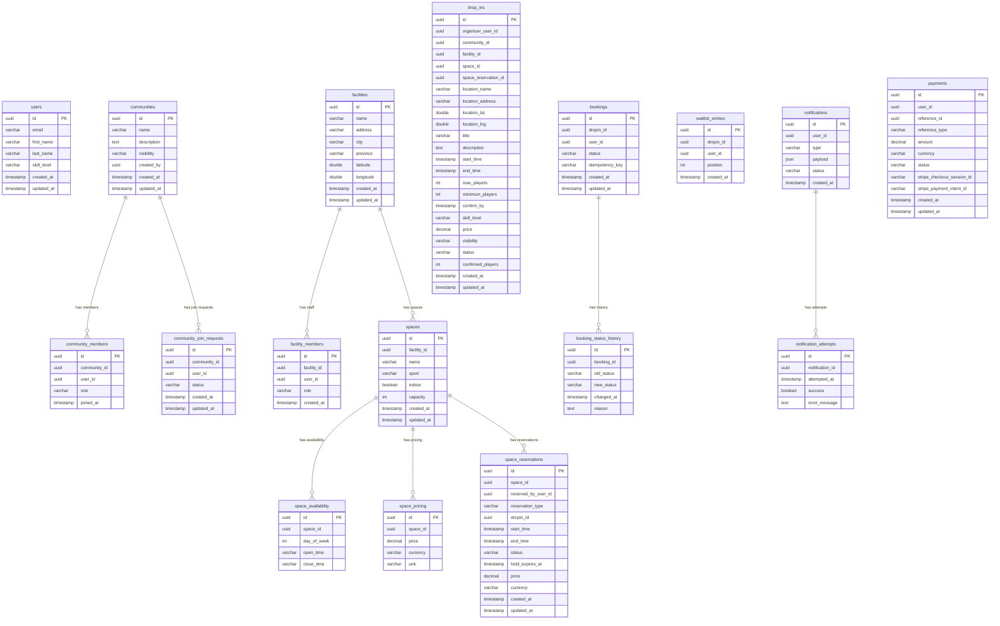

# CourtSync — ER Diagram (Mermaid)

> Cross-service UUID columns are **not** real foreign keys — each service owns its own schema.

```mermaid
erDiagram

    users {
        uuid      id           PK
        varchar   email
        varchar   first_name
        varchar   last_name
        varchar   skill_level
        timestamp created_at
        timestamp updated_at
    }

    communities {
        uuid      id          PK
        varchar   name
        text      description
        varchar   visibility
        uuid      created_by
        timestamp created_at
        timestamp updated_at
    }

    community_members {
        uuid      id           PK
        uuid      community_id
        uuid      user_id
        varchar   role
        timestamp joined_at
    }

    community_join_requests {
        uuid      id           PK
        uuid      community_id
        uuid      user_id
        varchar   status
        timestamp created_at
        timestamp updated_at
    }

    communities ||--o{ community_members : "has members"
    communities ||--o{ community_join_requests : "has join requests"

    facilities {
        uuid      id          PK
        varchar   name
        varchar   address
        varchar   city
        varchar   province
        double    latitude
        double    longitude
        timestamp created_at
        timestamp updated_at
    }

    facility_members {
        uuid      id          PK
        uuid      facility_id
        uuid      user_id
        varchar   role
        timestamp created_at
    }

    spaces {
        uuid      id          PK
        uuid      facility_id
        varchar   name
        varchar   sport
        boolean   indoor
        int       capacity
        timestamp created_at
        timestamp updated_at
    }

    space_availability {
        uuid    id          PK
        uuid    space_id
        int     day_of_week
        varchar open_time
        varchar close_time
    }

    space_pricing {
        uuid    id       PK
        uuid    space_id
        decimal price
        varchar currency
        varchar unit
    }

    space_reservations {
        uuid      id                   PK
        uuid      space_id
        uuid      reserved_by_user_id
        varchar   reservation_type
        uuid      dropin_id
        timestamp start_time
        timestamp end_time
        varchar   status
        timestamp hold_expires_at
        decimal   price
        varchar   currency
        timestamp created_at
        timestamp updated_at
    }

    facilities ||--o{ facility_members : "has staff"
    facilities ||--o{ spaces : "has spaces"
    spaces ||--o{ space_availability : "has availability"
    spaces ||--o{ space_pricing : "has pricing"
    spaces ||--o{ space_reservations : "has reservations"

    drop_ins {
        uuid      id                   PK
        uuid      organizer_user_id
        uuid      community_id
        uuid      facility_id
        uuid      space_id
        uuid      space_reservation_id
        varchar   location_name
        varchar   location_address
        double    location_lat
        double    location_lng
        varchar   title
        text      description
        timestamp start_time
        timestamp end_time
        int       max_players
        int       minimum_players
        timestamp confirm_by
        varchar   skill_level
        decimal   price
        varchar   visibility
        varchar   status
        int       confirmed_players
        timestamp created_at
        timestamp updated_at
    }

    bookings {
        uuid      id              PK
        uuid      dropin_id
        uuid      user_id
        varchar   status
        varchar   idempotency_key
        timestamp created_at
        timestamp updated_at
    }

    waitlist_entries {
        uuid      id        PK
        uuid      dropin_id
        uuid      user_id
        int       position
        timestamp created_at
    }

    booking_status_history {
        uuid      id         PK
        uuid      booking_id
        varchar   old_status
        varchar   new_status
        timestamp changed_at
        text      reason
    }

    bookings ||--o{ booking_status_history : "has history"

    notifications {
        uuid      id         PK
        uuid      user_id
        varchar   type
        json      payload
        varchar   status
        timestamp created_at
    }

    notification_attempts {
        uuid      id              PK
        uuid      notification_id
        timestamp attempted_at
        boolean   success
        text      error_message
    }

    notifications ||--o{ notification_attempts : "has attempts"

    payments {
        uuid      id                         PK
        uuid      user_id
        uuid      reference_id
        varchar   reference_type
        decimal   amount
        varchar   currency
        varchar   status
        varchar   stripe_checkout_session_id
        varchar   stripe_payment_intent_id
        timestamp created_at
        timestamp updated_at
    }
```
